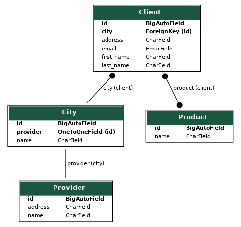

##  First django project

--------
* Done:
  * created project
  * created catalog app
  * catalog app added to INSTALLED_APPS
  * created models Provider, City, Client, Product
  * created graph model
  
  * created requests for SQL!
  * created pythagor app
  * pythagor app added to INSTALLED_APPS
  * created views hypotenuse and index
  * created forms
  * created templates hypotenuse and index
  * created models with user
  * created modelform for this user
  * created views and templates for POST form
  * created log models
  * created log middleware
  * created admin for pythagor app
--------
_Project used django, sqlparse and asgiref library_


**How to start project**
* install all from requirements.txt
* for start project write in terminal:
```
    
    $ python manage.py runserver
    
```
* for migration run:
```
    
    $ python manage.py migrate
    
```
* for create graph model:
```
    
    ./manage.py graph_models -a -I Provider, City, Product, Client -o my_project.png
    
```
* for check GET and POST form:
```
    
    http://127.0.0.1:8000/
    
```
* for check admin:
```
    
    http://127.0.0.1:8000/admin/
    
```
--------
Project checked by flake8
